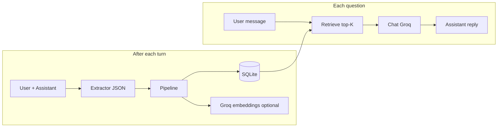

# Mnemo

[](https://github.com/2005-Aneeshdutt/Mnemo-/actions/workflows/ci.yml)
[](LICENSE)
[](https://www.python.org/downloads/)

Mnemo is a persistent memory layer for LLM agents. It converts dialogue into structured memories (facts, triples, summaries), stores them in SQLite, retrieves the best context using hybrid ranking, and injects that context back into generation.

The goal is simple: better long-term recall without sending full conversation history every turn.

## Table of Contents

- [Why Mnemo](#why-mnemo)
- [Core Capabilities](#core-capabilities)
- [Architecture](#architecture)
- [Prerequisites](#prerequisites)
- [Installation and Quick Start](#installation-and-quick-start)
- [CLI Usage](#cli-usage)
- [HTTP API](#http-api)
- [Configuration](#configuration)
- [Evaluation](#evaluation)
- [Development](#development)
- [Troubleshooting](#troubleshooting)
- [Roadmap](#roadmap)
- [License](#license)

## Why Mnemo

Most chat systems either:
- keep everything in prompt context (costly and noisy), or
- keep too little context (poor recall).

Mnemo provides a middle path:
- **Structured ingestion**: pull durable memory from each turn.
- **Targeted retrieval**: fetch only context likely to help the current query.
- **Scoped isolation**: separate memory per tenant and session (`tenant::session`).
- **Configurable quality/latency**: lexical-only mode, or dense + ANN for scale.

## Core Capabilities

| Area | Details |
|------|---------|
| **Memory extraction** | JSON extraction pipeline for facts, semantic triples, and turn summaries |
| **Persistence** | SQLite-backed storage with session and tenant scoping |
| **Retrieval** | Hybrid ranking (dense + lexical + recency) with optional FAISS ANN prefilter |
| **Embeddings** | Groq embeddings with fallback model chain support |
| **Interfaces** | Interactive CLI and FastAPI service |
| **Operational quality** | Pytest suite and GitHub Actions CI |

## Architecture



## Prerequisites

- Python **3.11+** (CI runs on Python 3.12)
- A [Groq](https://console.groq.com/) API key

## Installation and Quick Start

```bash
git clone https://github.com/2005-Aneeshdutt/Mnemo-.git
cd Mnemo-
python -m venv .venv
```

Activate virtual environment:
- **Windows (PowerShell):** `.\\.venv\\Scripts\\Activate.ps1`
- **Unix/macOS:** `source .venv/bin/activate`

Install and configure:

```bash
pip install -r requirements.txt
cp .env.example .env
```

Set `GROQ_API_KEY` in `.env` as a single line value (no quotes/backticks).

## CLI Usage

Start the CLI:

```bash
python main.py
```

Options:

```bash
python main.py --tenant acme --session support-42
python main.py --no-embeddings
```

Built-in commands in CLI session:
- `/memory` show stored memories for the scoped session
- `/triples` show extracted triples only
- `/clear` clear memory for the current session
- `/help` list commands
- `/quit` exit

## HTTP API

Run API server:

```bash
python main.py serve
```

OpenAPI docs: `http://127.0.0.1:8765/docs`

If `MNEMO_API_KEY` is set, provide one of:
- `X-API-Key: <token>`
- `Authorization: Bearer <token>`

### Endpoints

| Method | Path | Description |
|--------|------|-------------|
| `GET` | `/health` | Liveness check |
| `POST` | `/v1/chat` | Chat turn with retrieval + memory write |
| `GET` | `/v1/sessions/{session_id}/memory` | List stored memory rows for a session |
| `DELETE` | `/v1/sessions/{session_id}/memory` | Delete stored memory rows for a session |

### Examples

Health:

```bash
curl -s http://127.0.0.1:8765/health
```

Chat:

```bash
curl -s http://127.0.0.1:8765/v1/chat \
  -H "Content-Type: application/json" \
  -d "{\"tenant_id\":\"demo\",\"session_id\":\"thread-1\",\"message\":\"Remember my favorite color is blue.\"}"
```

List memory:

```bash
curl -s http://127.0.0.1:8765/v1/sessions/thread-1/memory \
  -H "X-Tenant-ID: demo"
```

Delete memory:

```bash
curl -s -X DELETE http://127.0.0.1:8765/v1/sessions/thread-1/memory \
  -H "X-Tenant-ID: demo"
```

## Configuration

Copy `.env.example` to `.env`. Mnemo supports both `MNEMO_*` keys and legacy `MEMORI_*` fallback keys.

### Required

| Variable | Purpose |
|----------|---------|
| `GROQ_API_KEY` | Required for chat/extraction (and embeddings unless disabled). |

### Model Selection

| Variable | Purpose |
|----------|---------|
| `GROQ_MODEL` | Chat model override |
| `GROQ_EXTRACT_MODEL` | Extraction model override |
| `GROQ_EMBED_MODEL` | Primary embedding model |
| `GROQ_EMBED_MODEL_FALLBACKS` | Comma-separated fallback embedding models |

### Retrieval and Memory

| Variable | Purpose |
|----------|---------|
| `MNEMO_NO_EMBEDDINGS` | `1` for lexical-only retrieval |
| `MNEMO_TOP_K` | Number of retrieved memory items |
| `MNEMO_RECENT_MSG` | Recent chat turns retained in short-term context |
| `MNEMO_W_DENSE` | Dense similarity weight |
| `MNEMO_W_LEX` | Lexical match weight |
| `MNEMO_W_REC` | Recency weight |
| `MNEMO_DB_PATH` | SQLite path (default: `data/memory.db`) |

### ANN (FAISS) Tuning

| Variable | Purpose |
|----------|---------|
| `MNEMO_ANN_ENABLED` | Enable ANN prefilter |
| `MNEMO_ANN_MIN_ROWS` | Minimum vector rows before ANN is used |
| `MNEMO_ANN_CANDIDATE_MULT` | Candidate multiplier relative to `TOP_K` |
| `MNEMO_ANN_MIN_CANDIDATES` | Lower bound on ANN candidate set |
| `MNEMO_ANN_MAX_CANDIDATES` | Upper bound on ANN candidate set |

### API and Rate Limits

| Variable | Purpose |
|----------|---------|
| `MNEMO_API_HOST` | API bind host |
| `MNEMO_API_PORT` | API bind port |
| `MNEMO_API_KEY` | Optional API key required by protected endpoints |
| `MNEMO_RATE_LIMIT` | Default route rate limit |
| `MNEMO_RATE_LIMIT_CHAT` | Chat endpoint rate limit |

## Evaluation

Mnemo includes a LoCoMo-style evaluation harness with two modes:
- **memory**: full Mnemo memory pipeline
- **baseline**: last-N-only baseline

Run:

```bash
python eval/run_locomo.py eval/data/sample_locomo.json --mode both --report eval/results/report.json
```

Mode reference:

| `--mode` | Behavior |
|----------|----------|
| `memory` | Mnemo retrieval + memory |
| `baseline` | Last-*N* chat baseline (no persistent memory) |
| `both` | Runs both and emits pass-rate comparison + optional prompt token estimates |

## Development

Run tests:

```bash
pytest -q
```

CI runs on pushes and pull requests targeting `main`/`master`.

## Troubleshooting

| Issue | What to try |
|-------|-------------|
| Missing API key | Set `GROQ_API_KEY` in `.env` and restart process |
| Embedding failures | Use `MNEMO_NO_EMBEDDINGS=1` or fix embed model/fallbacks |
| Unauthorized API requests | Ensure `MNEMO_API_KEY` matches `X-API-Key` or Bearer token |
| `500` on `/v1/chat` | Verify dependencies and DB path; SQLite connection uses `check_same_thread=False` in current implementation |

## Roadmap

- Additional backing stores beyond SQLite
- Stronger benchmark datasets and metrics dashboards
- Retrieval diagnostics and explainability output
- Production deployment guides (containers, observability, scaling)

## License

[Apache 2.0](LICENSE)

## Author

[Aneesh Dutt](https://github.com/2005-Aneeshdutt)
