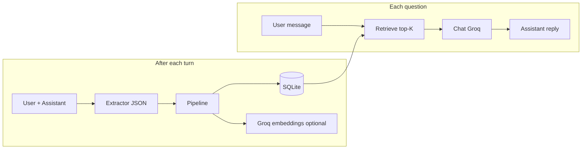

# Mnemo

**Structured persistent memory for LLM agents** — extract durable facts, semantic triples, and turn summaries from dialogue; store them in **SQLite**; retrieve the most relevant slice with **hybrid search** (dense + lexical + recency, optional **FAISS** prefilter); inject into the system prompt so the model recalls context **without** sending the full chat every time.

[](LICENSE)
[](https://www.python.org/downloads/)

## Features

| Area | Details |
|------|---------|
| **Augmentation** | JSON extraction: facts, semantic triples, turn summaries |
| **Storage** | SQLite; tenant/session scoping (`tenant::session`) |
| **Retrieval** | Hybrid scoring; optional ANN when embeddings exist |
| **Embeddings** | Groq with model fallback; `MNEMO_NO_EMBEDDINGS=1` for lexical-only |
| **Interfaces** | CLI (`main.py`) and FastAPI (`main.py serve`) |
| **Quality** | Pytest, GitHub Actions CI |

## Architecture



## Prerequisites

- Python **3.11+**
- [Groq](https://console.groq.com/) API key

## Quick start

```bash
git clone https://github.com/2005-Aneeshdutt/Mnemo-.git
cd Mnemo-
python -m venv .venv
```

**Windows:** `.\.venv\Scripts\activate` · **Unix:** `source .venv/bin/activate`

```bash
pip install -r requirements.txt
cp .env.example .env
```

Set `GROQ_API_KEY` in `.env` (single line, no quotes or backticks).

### CLI

```bash
python main.py
```

Use `--tenant`, `--session`, `--no-embeddings` as needed.

### HTTP API

```bash
python main.py serve
```

Open **http://127.0.0.1:8765/docs**. If `MNEMO_API_KEY` is set, send `X-API-Key` or `Authorization: Bearer`.

## Evaluation

```bash
python eval/run_locomo.py eval/data/sample_locomo.json --report eval/results/report.json --mode both
```

## Development

```bash
pytest -q
```

## Troubleshooting

| Issue | Try |
|-------|-----|
| Missing API key | Set `GROQ_API_KEY` in `.env` |
| Embedding errors | `MNEMO_NO_EMBEDDINGS=1` |
| `500` on `/v1/chat` | Ensure SQLite uses `check_same_thread=False` (current `mnemo/store.py`) |

## License

[Apache 2.0](LICENSE)

## Author

[Aneesh Dutt](https://github.com/2005-Aneeshdutt)
